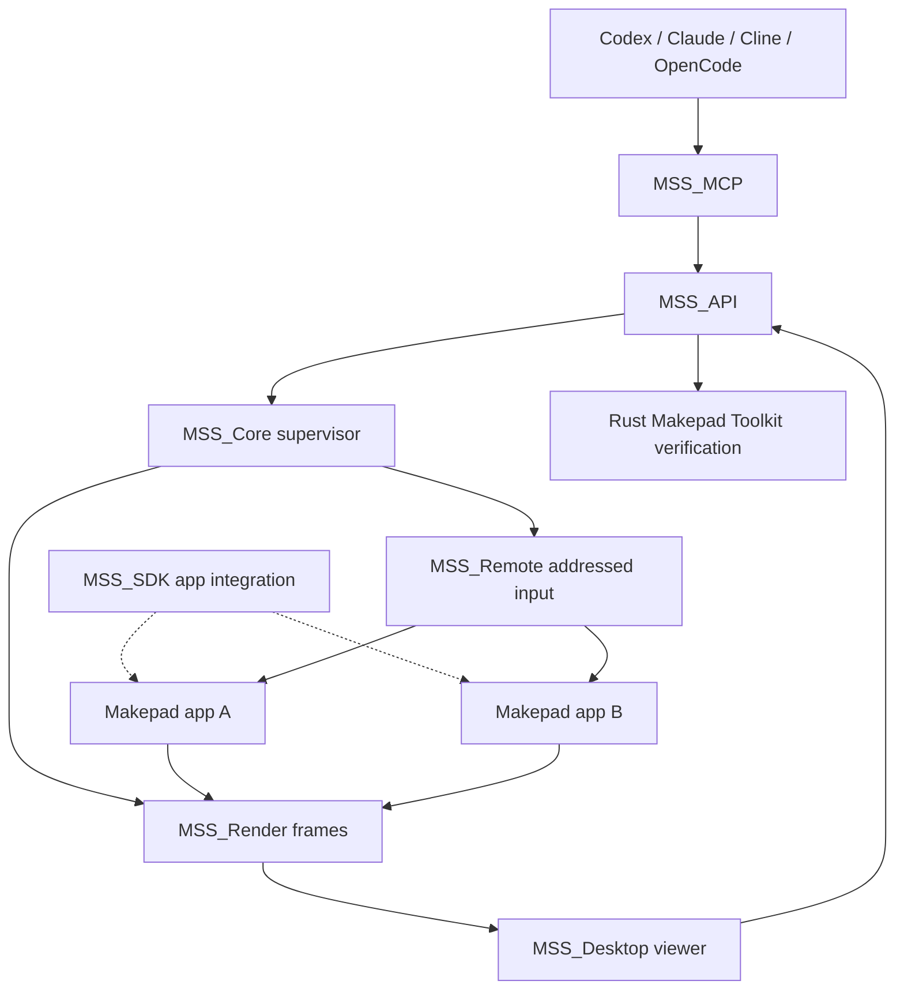
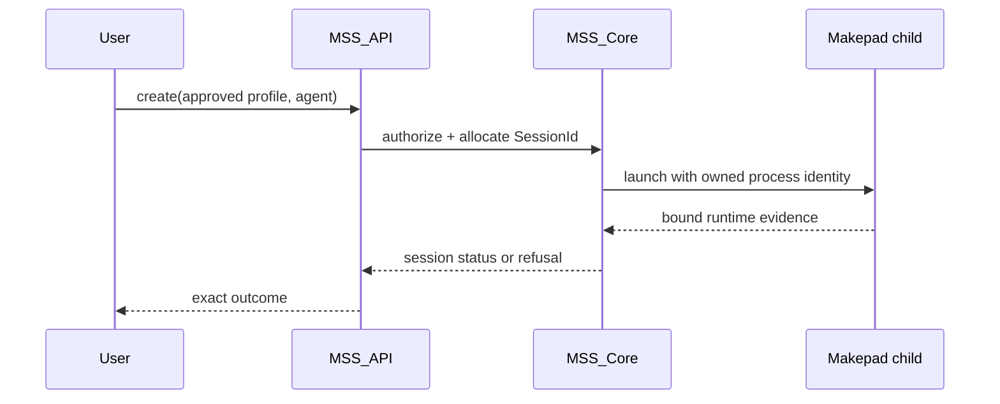
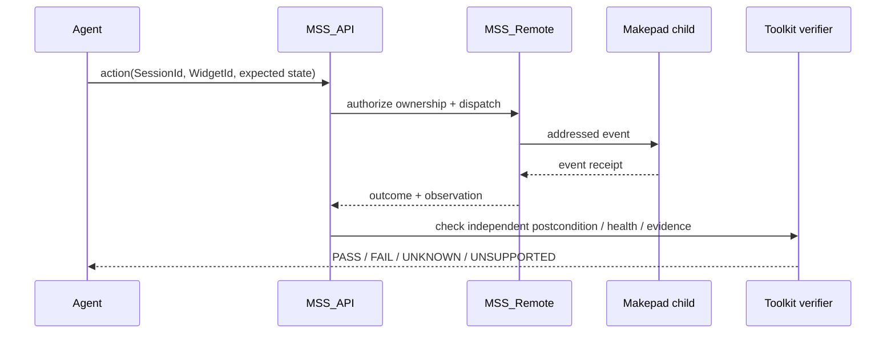
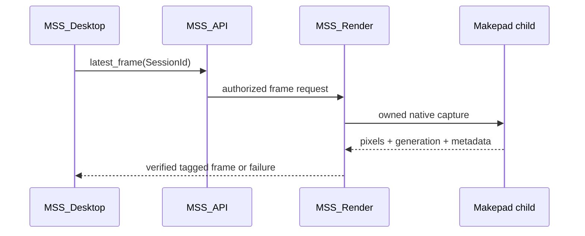

# MSS project maps

All diagrams describe **proposed** interactions, not verified implementation.

## Components

```mermaid
flowchart TB
  Agents["Codex / Claude / Cline / OpenCode"] --> MCP["MSS_MCP"]
  Desktop["MSS_Desktop viewer"] --> API["MSS_API"]
  MCP --> API
  API --> Core["MSS_Core supervisor"]
  API --> Toolkit["Rust Makepad Toolkit verification"]
  Core --> Remote["MSS_Remote addressed input"]
  Core --> Render["MSS_Render frames"]
  SDK["MSS_SDK app integration"] -.-> A["Makepad app A"]
  SDK -.-> B["Makepad app B"]
  Remote --> A
  Remote --> B
  A --> Render
  B --> Render
  Render --> Desktop
```

## Session creation

```mermaid
sequenceDiagram
  participant User
  participant API as MSS_API
  participant Core as MSS_Core
  participant App as Makepad child
  User->>API: create(approved profile, agent)
  API->>Core: authorize + allocate SessionId
  Core->>App: launch with owned process identity
  App-->>Core: bound runtime evidence
  Core-->>API: session status or refusal
  API-->>User: exact outcome
```

## GUI action and verification

```mermaid
sequenceDiagram
  participant Agent
  participant API as MSS_API
  participant R as MSS_Remote
  participant App as Makepad child
  participant Verify as Toolkit verifier
  Agent->>API: action(SessionId, WidgetId, expected state)
  API->>R: authorize ownership + dispatch
  R->>App: addressed event
  App-->>R: event receipt
  R-->>API: outcome + observation
  API->>Verify: check independent postcondition / health / evidence
  Verify-->>Agent: PASS / FAIL / UNKNOWN / UNSUPPORTED
```

## Capture

```mermaid
sequenceDiagram
  participant Desktop as MSS_Desktop
  participant API as MSS_API
  participant Render as MSS_Render
  participant App as Makepad child
  Desktop->>API: latest_frame(SessionId)
  API->>Render: authorized frame request
  Render->>App: owned native capture
  App-->>Render: pixels + generation + metadata
  Render-->>Desktop: verified tagged frame or failure
```
